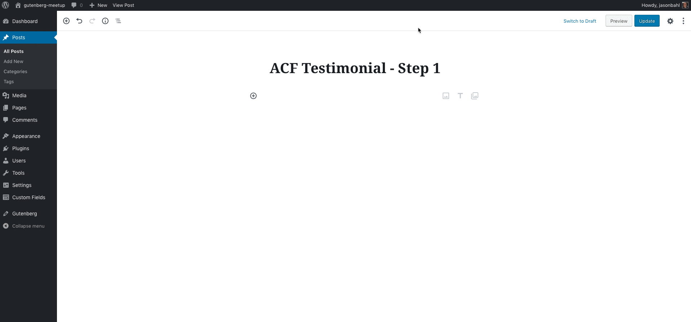
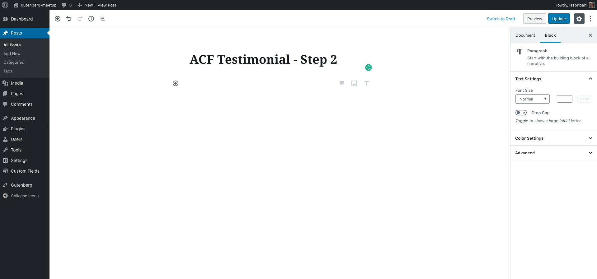

# Gutenberg Testimonial ACF Example

This is an example Testimonial Gutenberg Block using [Advanced Custom Fields Pro's Gutenberg features](https://www.advancedcustomfields.com/blog/acf-5-8-introducing-acf-blocks-for-gutenberg/).

> **Note:** You must have ACF Pro installed in order for this block to work.

This block is for demonstration purposes and was created to show at the Denver WordPress Developer
Meetup on November 14, 2018.

## Tutorial
The commits are broken into steps. You can view the diffs and the commit messages to read about how
the block was created step-by-step. 

### Step 1: 
[Register the block - DIFF](https://github.com/jasonbahl/gutenberg-testimonial-acf-example/compare/ed197a9bad04d09d7dd8d11d51518554afb5faae...steps/1-register-block)

In this step we: 
- hook into `acf/init` to ensure Advanced Custom Fields has been initialized
- register the block using the ACF function `acf_register_block`
  - This registers a block to Gutenberg, but also adds the block as a new Context for ACF Fields to be applied to.
- define a `render_callback` which is how Gutenberg renders dynamic blocks. 
  - Here, we define our callback as `acf_testimonial_callback`, and inside that function we output some simple markup.

At this point, we can now add the `ACF Testimonial Block` in Gutenberg, and we will see the name of the block rendered in the Editor and in our Theme when the post is saved.

## Step 2:
[Block Markup and Styles - DIFF](https://github.com/jasonbahl/gutenberg-testimonial-acf-example/compare/steps/1-register-block...steps/2-block-markup?expand=1)

In this step we:
 
- write the markup we want to use to output our Block in our theme. This will also be the same markup used for previewing the component while editing in Gutenberg.
- define a few variables that we will want to be editable when interacting with the block: `$testimonial`, `$alignment`, `$avatar_url`, `$name`, `$text_color` and `$background_color`. 
  - For now, we've hard-coded their values so we can test our markup and make sure it looks ok.
  - For styling, we output a `<style>` tag along with our block markup, and we use some of our variables to make the styles dynamic.

At this point, we can see our Block taking shape, both in the Gutenberg UI and in our Theme when we save a post and look at it.

### Step 3:
[Register & Connect Fields - DIFF](https://github.com/jasonbahl/gutenberg-testimonial-acf-example/compare/steps/2-block-markup...steps/3-register-acf-fields?expand=1)

In this step we:

- register our ACF fields. 
  - **note:** You can use the Advanced Custom Fields UI to register your fields, *or* you can register the fields via code, like we've done here. . .There's also an option to use JSON for the field registration.
  - register the following fields:
    - testimonial
    - avatar
    - name
    - background_color
    - text_color
    - alignment
- use the values of the fields in our `acf_testimonial_callback()` function, replacing our hard-coded variable values.

Now, we have a fully interactive block with fields we can edit interactively and we see live previews of our changes, and our theme renders the dynamic values in our markup and styles.

Neat!

